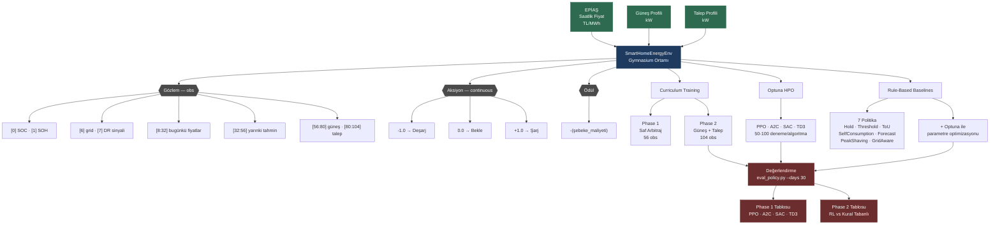

# 🏠 SmartHome Energy RL

> Pekiştirmeli Öğrenme ile güneş paneli ve bataryası olan bir evin enerji maliyetini minimize eden akıllı ajan.


> **Not:** Bu proje gerçek zamanlı bir enerji yönetim sistemi değildir. Staj kapsamında geliştirilen akademik bir RL araştırma prototipidir.

---

## İçindekiler

- [Proje Amacı](#proje-amacı)
- [Sistem Akışı](#sistem-akışı)
- [Curriculum Yapısı](#curriculum-yapısı)
- [Kural Tabanlı Baseline Politikalar](#kural-tabanlı-baseline-politikalar)
- [Teknoloji Yığını](#teknoloji-yığını)
- [Proje Yapısı](#proje-yapısı)
- [Kurulum](#kurulum)
- [Kullanım](#kullanım)
- [Testler](#testler)
- [GitHub Disiplini](#github-disiplini)

---

## Proje Amacı

Türkiye'de elektrik fiyatı saatlik olarak değişiyor (EPİAŞ gün öncesi piyasası). Güneş paneli olan bir ev, ürettiği enerjiyi bataryada depolayıp en pahalı saatlerde kullanabilir — ama bunu optimal şekilde yapmak için saatlik fiyatı, güneş üretimini ve ev talebini aynı anda değerlendirmek gerekiyor.

**Problem:** Basit sabit kurallar (gece şarj et, akşam deşarj et) bu karmaşıklığı yönetemiyor.

**Çözüm:** RL ajanı, ortamla etkileşime girerek deneme-yanılma yoluyla optimal batarya stratejisini öğreniyor. Bu proje, RL'nin kural tabanlı yaklaşımlara kıyasla ne kadar avantaj sağladığını ölçüyor.

---

## Sistem Akışı



---

## Curriculum Yapısı

RL'de en büyük risk yakınsama (convergence) sorunudur. Bunu önlemek için ortam tek seferde tam karmaşıklığıyla kurulmadı; iki aşamada inşa edildi.

```
PHASE 1 — Saf Batarya Arbitrajı
────────────────────────────────
Obs: [SOC | SOH | zaman | grid | DR | fiyat(24) | yarın(24)]
                                                    ↑ 56 boyut

Beklenti: Ajan gece ucuzken şarj edip akşam
          pahalıyken deşarj etmeyi öğrenmeli.
          
          ✓ Doğrulandı → Phase 2'ye geç


PHASE 2 — Güneş + Talep + Gerçek Dünya
────────────────────────────────────────
Obs: Phase 1 + [güneş_profil(24) | talep_profil(24)]
                                          ↑ 104 boyut

Yeni zorluklar:
  • Güneş fazlasını bataryada depola
  • Şebeke kesintisinde rezerv tut (obs[6]=0)
  • DR sinyalinde deşarj yap (obs[7]=1)
  • Yarınki fiyat tahminiyle (obs[32:56]) strateji kur
```

---

## Kural Tabanlı Baseline Politikalar

`src/baselines/rule_based.py` — 7 politika, aynı Gymnasium ortamında çalışır, RL ile doğrudan karşılaştırılabilir.

Tüm politikalar Optuna ile de optimize edildi (`scripts/hpo/rule_based_optuna.py`, 50 deneme/politika).

| Politika | Karar Mantığı | Gerçek Dünya Karşılığı |
|---|---|---|
| `HoldPolicy` | Her zaman `0` döndür | Batarya yok senaryosu |
| `ThresholdPolicy` | Fiyat < P30 → şarj, Fiyat > P70 → deşarj | Basit arbitraj uygulamaları |
| `SelfConsumptionPolicy` | Güneş fazlası → şarj, yüksek fiyat → deşarj | SMA, Fronius EV-Charger mantığı |
| `ToUPolicy` | Saat 23-07 → şarj, 17-22 → deşarj | TEDAŞ T2 tarifesindeki kullanıcılar |
| `ForecastAwarePolicy` | Yarın pahalıysa bugün agresif şarj | Tesla Powerwall, SMA Sunny Home Manager |
| `PeakShavingPolicy` | Net çekiş > eşik → bataryadan karşıla | Ticari bina talep bedeli yönetimi |
| `GridAwarePolicy` | grid=0 → rezerv koru, DR=1 → deşarj | Kesintili şebeke, akıllı şebeke entegrasyonu |

---

## Teknoloji Yığını

| Katman | Teknoloji | Açıklama |
|---|---|---|
| Dil | Python 3.11+ | |
| RL Ortamı | Gymnasium 0.29 | Özel `SmartHomeEnergyEnv` |
| RL Algoritmaları | Stable-Baselines3 | PPO, A2C (on-policy) · SAC, TD3 (off-policy) |
| HPO | Optuna + TPE Sampler | SQLite backend, her algoritma için ayrı study |
| Veri | EPİAŞ Şeffaflık Platformu | Gerçek saatlik PTF fiyatları |
| Test | pytest | 24 birim testi, `conftest.py` ile path fix |
| Versiyon Kontrol | Git + GitHub | Branch koruma, PR zorunluluğu |

---

## Proje Yapısı

```
SmartHome-EnergyRL/
│
├── src/
│   ├── env/
│   │   ├── __init__.py
│   │   └── energy_env.py          # SmartHomeEnergyEnv — Phase 1 & 2
│   ├── data/
│   │   ├── epias_loader.py        # EPİAŞ fiyat verisi yükleme
│   │   ├── solar_profile.py       # Güneş üretim profili üretici
│   │   └── demand_profile.py      # Ev tüketim profili üretici
│   └── baselines/
│       ├── __init__.py
│       └── rule_based.py          # 7 kural tabanlı baseline politika
│
├── scripts/
│   ├── train/                     # Eğitim scriptleri
│   │   ├── ppo_phase1.py          # Phase 1: PPO
│   │   ├── a2c_phase1.py          # Phase 1: A2C
│   │   ├── sac_phase1.py          # Phase 1: SAC
│   │   ├── td3_phase1.py          # Phase 1: TD3
│   │   ├── ppo_phase2.py          # Phase 2: PPO (default)
│   │   ├── ppo_phase2_optuna.py   # Phase 2: PPO (Optuna params)
│   │   ├── a2c_phase2.py          # Phase 2: A2C (Optuna params)
│   │   ├── a2c_phase2_default.py  # Phase 2: A2C (default)
│   │   ├── sac_phase2.py          # Phase 2: SAC (Optuna params)
│   │   ├── sac_phase2_default.py  # Phase 2: SAC (default)
│   │   ├── td3_phase2.py          # Phase 2: TD3 (Optuna params)
│   │   └── td3_phase2_default.py  # Phase 2: TD3 (default)
│   ├── hpo/                       # Hiperparametre optimizasyonu
│   │   ├── ppo.py
│   │   ├── a2c.py
│   │   ├── sac.py
│   │   ├── td3.py
│   │   └── rule_based_optuna.py   # Kural tabanlı politika HPO
│   ├── eval/
│   │   ├── eval_policy.py         # Phase 1 + Phase 2 karşılaştırma
│   │   ├── plot_comparison.py
│   │   └── plot_comparison_phase2.py
│   └── utils/
│       ├── enjoy_phase2.py        # Eğitilmiş ajanı görselleştir
│       └── organize_models.py     # Model dosyalarını düzenle
│
├── models/                        # Eğitilmiş model dosyaları (.zip)
│   ├── ppo_smarthome_final.zip
│   ├── sac_smarthome_final.zip
│   └── ...
│
├── data/
│   ├── raw/                       # Ham EPİAŞ verisi
│   └── processed/
│       └── aligned_dataset.csv    # Hizalanmış fiyat + güneş + talep
│
├── logs/                          # Optuna DB + eğitim logları
│   ├── optuna_phase2.db
│   └── rule_based_optuna.db
│
├── tests/
│   ├── test_rule_based.py         # 7 politika için 24 birim testi
│   ├── test_energy_env.py
│   └── ...
│
├── docs/                          # Tasarım notları, deney kayıtları
├── conftest.py                    # pytest sys.path yapılandırması
├── requirements.txt
└── implementation_plan.md
```

---

## Kurulum

```bash
git clone https://github.com/isambais/SmartHome-EnergyRL.git
cd SmartHome-EnergyRL
pip install -r requirements.txt
```

---

## Kullanım

### 1. Eğitim

```bash
# Phase 1 — Saf arbitraj (önce bu tamamlanmalı)
python scripts/train/ppo_phase1.py
python scripts/train/a2c_phase1.py
python scripts/train/sac_phase1.py
python scripts/train/td3_phase1.py

# Phase 2 — Güneş + talep (Phase 1 doğrulandıktan sonra)
python scripts/train/sac_phase2.py
python scripts/train/td3_phase2.py
python scripts/train/ppo_phase2.py
python scripts/train/a2c_phase2.py
```

### 2. Hiperparametre Optimizasyonu

```bash
# RL algoritmaları (önce çalıştırılmalı, sonra eğitim)
python scripts/hpo/sac.py
python scripts/hpo/td3.py
python scripts/hpo/ppo.py
python scripts/hpo/a2c.py

# Kural tabanlı politikalar
python scripts/hpo/rule_based_optuna.py
```

### 3. Değerlendirme

```bash
# Phase 1 ve Phase 2 karşılaştırması (30 gün)
python scripts/eval/eval_policy.py --days 30

# Farklı süre için
python scripts/eval/eval_policy.py --days 90
```

---

## Testler

```bash
# Tüm testler
pytest tests/ -v

# Sadece baseline politika testleri
pytest tests/test_rule_based.py -v
```

```
tests/test_rule_based.py::TestHoldPolicy::test_always_zero          PASSED
tests/test_rule_based.py::TestThresholdPolicy::test_charge_when_cheap PASSED
tests/test_rule_based.py::TestToUPolicy::test_discharge_during_peak  PASSED
...
24 passed in 0.30s
```

---

## GitHub Disiplini

- **Branch Stratejisi:** Her özellik için ayrı `feature/` ya da `feat/` branch, `main`'e yalnızca PR ile birleşim
- **Commit Standardı:** Conventional Commits (`feat:`, `fix:`, `docs:`, `test:`)
- **Pull Request:** Her PR ne yapıldığını, neden yapıldığını ve sonuçları açıklar

---

## Durum

Aktif geliştirme — staj kapsamı, 20 iş günü.  
Güncel ilerleme için commit geçmişine ve [implementation_plan.md](./implementation_plan.md) dosyasına bakılabilir.
