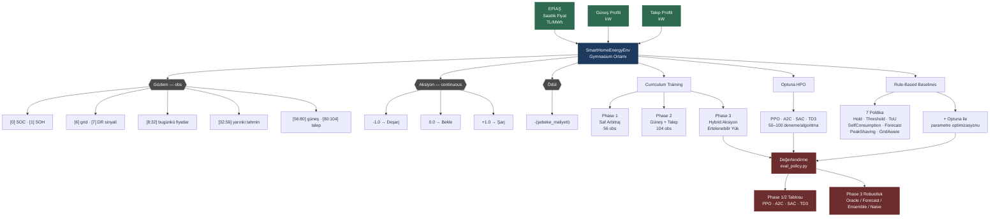

#  SmartHome Energy RL

> Pekiştirmeli öğrenme ile güneş paneli ve bataryası olan bir evin enerji maliyetini minimize eden akıllı ajan — ve bunu kullanıcıya sunan tam yığın web uygulaması.


> **Not:** Bu proje gerçek zamanlı bir enerji yönetim sistemi değildir. Staj kapsamında geliştirilen akademik bir RL araştırma prototipidir.

---

## İçindekiler

- [Proje Amacı](#proje-amacı)
- [Mimari](#mimari)
- [Sonuçlar](#sonuçlar)
- [Curriculum Yapısı](#curriculum-yapısı)
- [Kural Tabanlı Baseline Politikalar](#kural-tabanlı-baseline-politikalar)
- [Ortam Parametreleri](#ortam-parametreleri)
- [Teknoloji Yığını](#teknoloji-yığını)
- [Proje Yapısı](#proje-yapısı)
- [Kurulum](#kurulum)
- [Kullanım](#kullanım)
- [Testler](#testler)

---

## Proje Amacı

Türkiye'de elektrik fiyatı saatlik olarak değişiyor (EPİAŞ gün öncesi piyasası). Güneş paneli olan bir ev, ürettiği enerjiyi bataryada depolayıp en pahalı saatlerde kullanabilir — ama bunu optimal şekilde yapmak için saatlik fiyatı, güneş üretimini ve ev talebini aynı anda değerlendirmek gerekiyor.

**Problem:** Basit sabit kurallar (gece şarj et, akşam deşarj et) bu karmaşıklığı yönetemiyor.

**Çözüm:** RL ajanı, ortamla etkileşime girerek deneme-yanılma yoluyla optimal batarya stratejisini öğreniyor. Sonuçlar; gerçek EPİAŞ verisiyle eğitilmiş TD3/SAC ajanlarının kural tabanlı politikaları belirgin biçimde geçtiğini ve fiyat tahmin belirsizliğine karşı robust kaldığını gösteriyor.

---

## Mimari

Proje üç katmandan oluşuyor:

```
┌─────────────────────────────────────────────────────────────┐
│  React Frontend  (Vite · TypeScript · Framer Motion)        │
│  Simülasyon · EPİAŞ · Yatırım · Uzman · Profil             │
│  TR / EN / AR  ·  RTL desteği  ·  Lighthouse 100           │
└────────────────────────┬────────────────────────────────────┘
                         │ REST API / JWT
┌────────────────────────▼────────────────────────────────────┐
│  FastAPI Backend  (Python 3.11 · SQLite · uvicorn)          │
│  Auth · Simülasyon · EPİAŞ · Yatırım · Uzman · 3D Bina     │
└────────────────────────┬────────────────────────────────────┘
                         │
┌────────────────────────▼────────────────────────────────────┐
│  RL Çekirdeği  (Gymnasium · Stable-Baselines3 · Optuna)     │
│  SmartHomeEnergyEnv  ·  PPO / A2C / SAC / TD3               │
│  Phase 1 → Phase 2 → Phase 3  ·  7 kural tabanlı baseline  │
│  Veri: EPİAŞ PTF 2022–2026  (~40 K saat)                   │
└─────────────────────────────────────────────────────────────┘
```

### Sistem Akışı



---

## Sonuçlar

### Phase 1 — Saf Batarya Arbitrajı (30 gün, 56 obs)

```
python scripts/eval/eval_policy.py --days 30
```

| Model | Net Kazanç (TL/30 gün) |
|---|---|
| SAC | +8.98 |
| PPO | +7.67 |
| A2C | +3.19 |
| HoldPolicy (baseline) | 0.00 |

### Phase 2 — Kural Tabanlı Baseline (Optuna Öncesi/Sonrası)

| Politika | Varsayılan | Optuna Sonrası |
|---|---|---|
| ThresholdPolicy | −2.57 TL | **+2.53 TL** |
| ForecastAwarePolicy | — | +1.66 TL |
| GridAwarePolicy | — | +1.35 TL |

### Phase 3 — Tahmin Belirsizliğine Robustluk (74 günlük test seti)

Ajanlar dört farklı fiyat-bilgisi modunda değerlendirildi — yeniden eğitim yok. Değerler günlük ortalama net kazanç (TL/gün):

| Ajan | Oracle | Forecast | Ensemble | Naive | Δ Max–Min |
|---|---|---|---|---|---|
| **TD3** | +14.72 | +14.70 | +14.64 | +14.54 | 0.18 |
| **SAC** | +14.38 | +14.49 | +14.49 | +14.18 | 0.31 |
| PPO | +12.08 | +11.98 | +11.97 | +11.94 | 0.14 |
| A2C | −9.01 | −9.50 | −9.53 | −8.79 | 0.74 |
| FcAware (kural) | −3.34 | −2.30 | −2.15 | +5.73 | **9.07** |

**Bulgu:** TD3 ve SAC tüm modlarda ±0.2 TL içinde kalıyor → tahmin kalitesine bağımlı değil. Kural tabanlı FcAware ise modlar arasında 9 TL oynuyor — fiyat dağılımına aşırı duyarlı.

#### Cihaz Çalıştırma Oranı (reward-hacking kontrolü)

*Maks oran = 2 aktivasyon / 24 saat = 0.083*

| Ajan | Oracle | Forecast | Ensemble | Naive |
|---|---|---|---|---|
| SAC | 0.053 | 0.054 | 0.054 | 0.049 |
| TD3 | 0.068 | 0.065 | 0.066 | 0.067 |
| PPO | 0.083 | 0.083 | 0.083 | 0.083 |

PPO cihazı her modda tam kapasitede (0.083) çalıştırıyor — net değere bakmaksızın. SAC seçici karar veriyor, daha nitelikli öğrenme.

### Fiyat Tahmin Modelleri

| Model | sMAPE |
|---|---|
| LightGBM + Optuna | %29.93 |
| Ensemble (LGB + XGB + RF) | %32.10 |
| Naive (önceki gün aynı saat) | referans |

Tüm sonuçların kaynakları ve yeniden üretim komutları: [`docs/experiments/results-log.md`](./docs/experiments/results-log.md)

---

## Curriculum Yapısı

RL yakınsama sorununu önlemek için ortam üç aşamada inşa edildi:

| | Phase 1 | Phase 2 | Phase 3 |
|---|---|---|---|
| Amaç | Saf batarya arbitrajı | Güneş + talep entegrasyonu | Gerçek dünya senaryosu |
| Gözlem boyutu | 56 | 104 | 104 |
| Aksiyon | Sürekli [-1, +1] | Sürekli | Hybrid (sürekli + ayrık) |
| Ekstra | — | Güneş (24h) + talep (24h) | Ertelenebilir yük, multi-step |
| Durum | Doğrulandı | Doğrulandı | Doğrulandı |

---

## Kural Tabanlı Baseline Politikalar

`src/baselines/rule_based.py` — 7 politika, aynı Gymnasium ortamında çalışır, RL ile doğrudan karşılaştırılabilir. Tümü Optuna ile optimize edildi (`scripts/hpo/rule_based_optuna.py`, 50 deneme/politika).

| Politika | Karar Mantığı | Gerçek Dünya Karşılığı |
|---|---|---|
| `HoldPolicy` | Her zaman `0` döndür | Batarya yok senaryosu |
| `ThresholdPolicy` | Fiyat < P30 → şarj, Fiyat > P70 → deşarj | Basit arbitraj uygulamaları |
| `SelfConsumptionPolicy` | Güneş fazlası → şarj, yüksek fiyat → deşarj | SMA, Fronius EV-Charger mantığı |
| `ToUPolicy` | Saat 23-07 → şarj, 17-22 → deşarj | TEDAŞ T2 tarifesindeki kullanıcılar |
| `ForecastAwarePolicy` | Yarın pahalıysa bugün agresif şarj | Tesla Powerwall, SMA Sunny Home Manager |
| `PeakShavingPolicy` | Net çekiş > eşik → bataryadan karşıla | Ticari bina talep bedeli yönetimi |
| `GridAwarePolicy` | grid=0 → rezerv koru, DR=1 → deşarj | Kesintili şebeke, akıllı şebeke entegrasyonu |

---

## Ortam Parametreleri

`SmartHomeEnergyEnv` — `src/env/energy_env.py`

| Parametre | Değer | Açıklama |
|---|---|---|
| Batarya kapasitesi | 10 kWh | `battery_capacity_kwh` |
| Maks şarj/deşarj gücü | 5 kW | `max_power_kw` |
| Şarj verimliliği | %88–98 | C-rate'e bağlı değişken |
| Öz-deşarj | %0.05/saat | `self_discharge_per_hour` |
| Min SoC rezervi | %10 | Acil durum alt sınırı |
| SoH aralığı | 0.70–1.00 | Episode başında rastgele |
| Satış fiyatı | Alış × 0.60 | Geri besleme tarifesi |
| Şebeke kesinti olasılığı | %0.2/saat | `grid_outage_prob` |
| Episode uzunluğu | 24 saat | |
| Aksiyon uzayı | [-1.0, +1.0] sürekli | −1=deşarj, 0=bekle, +1=şarj |
| Gözlem boyutu | 56 (P1) / 104 (P2–P3) | |

---

## Teknoloji Yığını

| Katman | Teknoloji |
|---|---|
| **Web Arayüzü** | React 18 · Vite · Framer Motion · i18n (TR/EN/AR) · Lighthouse 100 |
| **API** | FastAPI · JWT auth · SQLite · uvicorn |
| **Dashboard** | Streamlit 4 sayfa · Three.js 3D bina · Plotly |
| **RL Ortamı** | Gymnasium 0.29 · Özel `SmartHomeEnergyEnv` |
| **RL Algoritmaları** | Stable-Baselines3 — PPO, A2C (on-policy) · SAC, TD3 (off-policy) |
| **HPO** | Optuna + TPE Sampler · SQLite backend |
| **Tahmin** | LightGBM + Optuna · XGBoost · Ensemble |
| **Veri** | EPİAŞ Şeffaflık Platformu — ~40.176 saatlik gerçek PTF (2022–2026) |
| **Test** | pytest · 65+ birim testi · Playwright (E2E) |

---

## Proje Yapısı

```
SmartHome-EnergyRL/
│
├── backend/                       # FastAPI — REST API + auth
│   ├── main.py                    # Tüm endpoint'ler
│   ├── auth.py                    # JWT + bcrypt
│   ├── models.py                  # SQLAlchemy modelleri
│   ├── db.py                      # SQLite bağlantısı
│   └── data.py                    # EPİAŞ + veri yardımcıları
│
├── frontend/                      # React 18 + Vite
│   ├── src/
│   │   ├── pages/
│   │   │   ├── Landing.jsx        # Tanıtım sayfası
│   │   │   ├── Simulasyon.jsx     # Günlük simülasyon
│   │   │   ├── Epias.jsx          # Canlı EPİAŞ verileri
│   │   │   ├── Yatirim.jsx        # Yatırım analizi
│   │   │   ├── Uzman.jsx          # Karşılaştırma + mevsimsel
│   │   │   ├── Profil.jsx         # Kullanıcı profili
│   │   │   └── Auth.jsx           # Giriş / kayıt
│   │   ├── components/
│   │   │   ├── ui.jsx             # Paylaşılan bileşenler
│   │   │   ├── TopNav.jsx
│   │   │   └── Building.jsx       # Three.js 3D bina
│   │   └── i18n.jsx               # TR / EN / AR çeviriler + RTL
│   └── package.json
│
├── dashboard/                     # Streamlit — araştırma arayüzü
│   ├── app.py
│   ├── core/
│   │   ├── simulate.py            # Günlük simülasyon motoru
│   │   ├── agent.py               # Ajan yükleme
│   │   ├── config.py              # Bina tipleri
│   │   └── threejs.py             # 3D HTML üretici
│   └── pages/
│       ├── 1_🏠_Bina_Simulasyonu.py
│       ├── 2_⚡_Canli_EPIAS.py
│       ├── 3_💰_Yatirim_ve_Cevre.py
│       └── 4_📊_Uzman_Modu.py
│
├── src/                           # RL çekirdeği
│   ├── env/
│   │   └── energy_env.py          # SmartHomeEnergyEnv (Phase 1–3)
│   ├── data/
│   │   ├── epias_loader.py
│   │   ├── solar_profile.py
│   │   └── demand_profile.py
│   └── baselines/
│       └── rule_based.py          # 7 kural tabanlı politika
│
├── scripts/
│   ├── train/                     # Phase 1–3 eğitim scriptleri
│   ├── hpo/                       # Optuna HPO (RL + kural tabanlı)
│   ├── eval/                      # Değerlendirme ve karşılaştırma
│   └── forecast/                  # LightGBM tahmin + compare.py
│
├── tests/
│   ├── test_energy_env.py
│   ├── test_rule_based.py
│   ├── test_security.py
│   ├── test_pages.py
│   └── ...                        # 65+ birim testi
│
├── data/
│   ├── raw/                       # Ham EPİAŞ CSV'leri
│   └── processed/
│       ├── aligned_dataset.csv    # Fiyat + güneş + talep (1 yıl)
│       └── epias_combined.csv     # ~40 K saatlik birleşik PTF
│
├── docs/
│   ├── experiments/results-log.md # Tüm eval sonuçları (izlenebilir)
│   └── gun_*_staj_defteri.md      # Günlük staj kayıtları
│
├── models/                        # Eğitilmiş model dosyaları (.zip)
├── logs/                          # Optuna DB + eğitim logları
├── .env.example                   # Ortam değişkeni şablonu
├── requirements.txt
└── conftest.py
```

---

## Kurulum

### RL Araştırma Ortamı

```bash
git clone https://github.com/isambais/SmartHome-EnergyRL.git
cd SmartHome-EnergyRL

python -m venv .venv
# Linux/macOS:
source .venv/bin/activate
# Windows:
.venv\Scripts\activate

pip install -r requirements.txt
pytest -q  # tüm testler geçmeli
```

### Web Uygulaması (Backend + Frontend)

```bash
# 1. Ortam değişkenlerini ayarla
cp .env.example .env
# .env dosyasını düzenle: SECRET_KEY, EPIAS_USER, EPIAS_PASS

# 2. Backend başlat (proje kökünden)
uvicorn backend.main:app --reload --port 8000
# API: http://localhost:8000
# Swagger: http://localhost:8000/docs

# 3. Frontend başlat (yeni terminal)
cd frontend
npm install
npm run dev
# Uygulama: http://localhost:5173
```

### Streamlit Dashboard

```bash
streamlit run dashboard/app.py
# Dashboard: http://localhost:8501
```

---

## Kullanım

### RL Eğitimi

```bash
# Phase 1 — Saf arbitraj (önce bu tamamlanmalı)
python scripts/train/ppo_phase1.py
python scripts/train/sac_phase1.py
python scripts/train/td3_phase1.py

# Phase 2 — Güneş + talep
python scripts/train/sac_phase2.py
python scripts/train/td3_phase2.py

# Hiperparametre optimizasyonu (Optuna)
python scripts/hpo/sac.py
python scripts/hpo/td3.py
```

### Değerlendirme

```bash
# Phase 1 + 2 karşılaştırması
python scripts/eval/eval_policy.py --days 30

# Phase 3 — tahmin belirsizliği robustluk testi
python scripts/forecast/compare.py
```

---

## Testler

### Birim Testleri

```bash
pytest tests/ -v
```

```
tests/test_energy_env.py      PASSED  (ortam fiziği)
tests/test_rule_based.py      PASSED  (7 politika)
tests/test_security.py        PASSED  (auth + JWT)
tests/test_pages.py           PASSED  (sayfa erişim)
...
65 passed in X.XXs
```

### E2E Testleri (Playwright)

```bash
cd frontend
npx playwright test
```

> `test_train_ppo.py` Stable-Baselines3 (PyTorch) gerektirir. Diğer tüm testler torch bağımlılığı olmadan koşturulabilir.

---

## Katkı ve İlerleme

Aktif geliştirme — staj kapsamı, 20 iş günü. Conventional Commits (`feat:`, `fix:`, `docs:`, `test:`), her özellik ayrı branch, `main`'e yalnızca PR ile birleşim.

Güncel ilerleme: [implementation_plan.md](./implementation_plan.md) · Deney sonuçları: [results-log.md](./docs/experiments/results-log.md)
